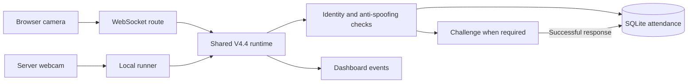

# Face Recognition Attendance with Multi-Cue Anti-Spoofing and Adaptive Challenge–Response

**Final implementation described: web runtime V4.4.**

This project combines face recognition with image and temporal checks before recording attendance. When an identified face remains suspicious after the rejection checks, the backend may request a short sequence of user actions.

This repository contains the FastAPI application, browser dashboard, tests, retained development scanners, and an IEEE-style report. The report describes application behavior at commit [`4a38c61`](https://github.com/sangvo1233-byte/Face-Recognition-Attendance-with-Multi-Cue-Anti-Spoofing-and-Adaptive-Challenge-Response/commit/4a38c61e37db70c6d3431d683fd96b6c04bc4c90); the documentation commits do not change the V4.4 algorithms.

## Read first

| Document | Purpose |
| --- | --- |
| [System and method](docs/system.md) | Architecture, enrollment, signals, decision order, and V4.4 parameters. |
| [Evaluation protocol](docs/evaluation.md) | A proposed evaluation of the existing implementation and the current evidence limits. |
| [IEEE-style report](paper/main.tex) | Standalone English LaTeX draft with inline figures and references. |
| [Compiled report](paper/main.pdf) | Verified four-page A4 PDF of the current draft. |
| [Development history](dev/README.md) | How to interpret the retained experimental scripts and older implementations. |

## Current evidence status

The design was inspected in source code. The focused software test command below passed during documentation integration, but the camera application and empirical protocol were not executed. The accepted report scope does not include an experimental dataset or measured V4.4 results. Accuracy, attack rejection rates, latency, and achieved FPS therefore remain unmeasured, and the report makes no claims about them.

The four-page A4 PDF was compiled with Tectonic and visually inspected. `paper/main.tex` remains the editable source of truth.

“Adaptive” means **rule-based selection according to suspicion severity**. It does not mean that the system learns a policy or automatically optimizes its thresholds. The existing pretrained recognition and landmark models are reused; a new recognition or anti-spoofing model is not claimed.

## Build the report

With Tectonic available, run this command from the repository root:

```powershell
tectonic -X compile --untrusted --outfmt pdf --outdir paper paper/main.tex
```

If the executable is not on `PATH`, invoke its full path in place of `tectonic`. The first run may download TeX packages and fonts into its cache. Rebuild `paper/main.pdf` after source edits.

## Application architecture



The backend owns the admission decision. The dashboard displays camera feedback, instructions, and attendance events. Both camera modes feed the same runtime. The default browser path is `/ws/scan-v4`; `/api/scan/v4` is a single-frame compatibility endpoint and does not replace a stateful streaming session.

## Run the application

Use Python 3.10 or newer. One Windows PowerShell setup is:

```powershell
python -m venv .venv
.\.venv\Scripts\Activate.ps1
python -m pip install -r requirements.txt
python -m pip install pytest
```

InsightFace is configured to use the `buffalo_l` model package. The stream tracker also needs `models/face_landmarker.task`:

```powershell
New-Item -ItemType Directory -Path .\models -Force
curl.exe --fail -L -o models/face_landmarker.task https://storage.googleapis.com/mediapipe-models/face_landmarker/face_landmarker/float16/1/face_landmarker.task
python main.py
```

Open `http://localhost:8000/`, start an attendance session, enroll a student using the front/left/right capture flow, and select the desired camera mode. Browser camera access on a remote machine generally requires a secure context; use the existing deployment instructions appropriate to the environment.

When enabled by `API_DOCS_ENABLED`, interactive API documentation is available at `/docs`. Basic checks are exposed at `/health`, `/ready`, and `/version`.

The pretrained models distributed by InsightFace have separate non-commercial research terms. Review the model license before using them outside an academic project.

`config.py` reads process environment variables. Copying `.env.example` to `.env` alone does not establish that the `python main.py` entrypoint loads that file. Set supported variables in the process environment when needed, for example:

```powershell
$env:AUTO_START_CAMERA = 'false'
python main.py
```

At the inspected commit, `CAMERA_SOURCE` is set directly in `config.py`; it is not read from the process environment. Do not describe an environment override for it until that behavior is implemented and verified.

## Verification commands and their scope

```powershell
python -m pytest tests/test_detect_v4.py tests/test_v2_v3.py -q
node --check web/js/main.js
node --check web/js/scan.js
node --check web/js/enrollment.js
```

The selected Python files exercise logic and contain mocks or synthetic inputs. They are supporting software checks, not measurements of resistance to real attacks. Node.js is needed only for the optional JavaScript syntax checks.

The broad command `python -m pytest -q` can discover `tests/test_core.py`. That integration test uses an external video path and writes runtime data if the required files exist. It also exercises the older single-frame engine, rather than the final V4.4 stream. Use the explicit command above for the documented focused suite; do not treat the `integration` marker as an automatic opt-out.

## Source repository map

| Path in the application repository | Responsibility |
| --- | --- |
| `main.py` | FastAPI startup and application entrypoint. |
| `config.py` | Shared configuration, paths, and existing stream settings. |
| `app/routes/scan_v4.py` | V4.4 browser and local-camera interfaces. |
| `core/runtime_v4.py` | Stateful decisions, challenges, identity checks, and attendance admission. |
| `core/detect_v4.py` | V4.4 detectors, rolling decisions, parameters, and result helpers. |
| `core/face_engine.py` | Pretrained face analysis and embedding matching. |
| `core/enrollment_v2.py` | Multi-angle enrollment. |
| `core/liveness.py`, `core/anti_spoof.py` | Temporal landmark checks and passive image heuristics. |
| `web/`, `tests/`, `dev/` | Interface, software checks, and development history. |

`models/`, `database/`, and `logs/` contain local model files or runtime data. Preserve their contents. The absence of a file from Git is not evidence that its local copy is disposable.

## Report scope and limitations

The report describes a camera-based system intended to address print and display replay attempts. Coverage of any attack type remains a question for measurement. Depth sensing, mask attacks, real-time face swaps, digital injection, and attacks against the backend are not established capabilities of this design.

Thresholds are implementation settings, not empirically calibrated values in this repository. Challenge state is process-local. Lighting, motion, display characteristics, camera quality, and compression can affect the signals. The UI's cosine-derived `confidence` value is a similarity score, not a probability of correct identification.
