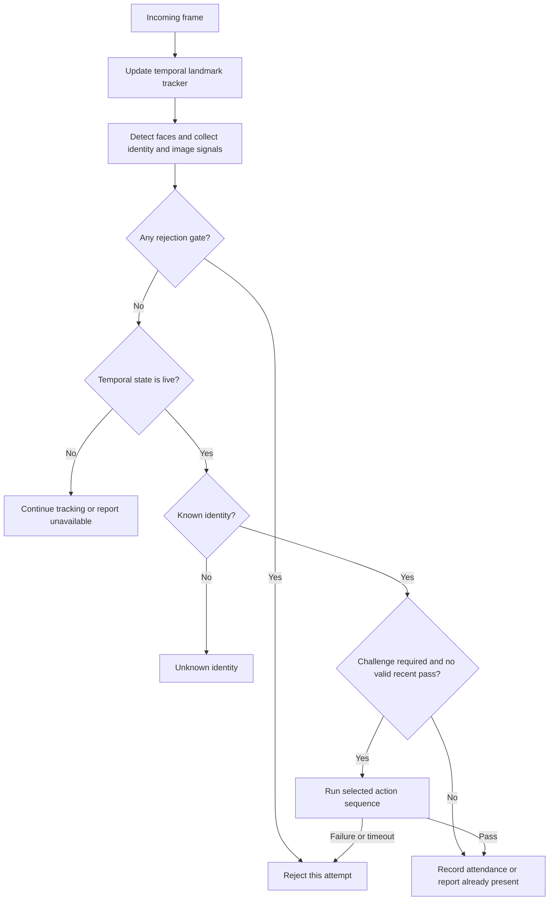

# V4.4 System and Method

## Version boundary

This document describes the web V4.4 implementation at commit `4a38c61e37db70c6d3431d683fd96b6c04bc4c90` of [Face Recognition Attendance with Multi-Cue Anti-Spoofing and Adaptive Challenge-Response](https://github.com/sangvo1233-byte/Face-Recognition-Attendance-with-Multi-Cue-Anti-Spoofing-and-Adaptive-Challenge-Response). V4.4 is the selected final version for the project report. “Final” identifies the reporting baseline; it does not establish production readiness or measured effectiveness.

The canonical decision code is `core/runtime_v4.py` with detectors in `core/detect_v4.py`. The independent OpenCV scanner `dev/detect-v4.4.py` is a development artifact, not an interchangeable description of the web runtime.

## Concepts

| Term | Meaning in this implementation |
| --- | --- |
| Embedding | A normalized vector representing facial identity features. |
| Cosine similarity | The dot product of normalized query and stored vectors; used for matching. |
| Presentation attack | An attempt to impersonate a person by presenting an artifact, such as a photograph or display, to the camera. |
| Passive image check | A heuristic computed without asking for an additional action. |
| Temporal liveness | Observations of landmark-derived blink and movement behavior across frames. |
| Active challenge | An instruction sequence whose response is checked before attendance admission. |
| Adaptive selection | A rule-based choice of challenge pool from the current suspicion severity. |

## Components and data flow

The browser sends camera frames through a WebSocket route. Alternatively, a local runner reads the webcam attached to the server. Both modes provide frames to a `DetectV4RuntimeSession`. The runtime extracts identity information, maintains per-face signal history, applies gates, manages a challenge when needed, and sends events to the interface. Accepted attendance records and evidence-image paths are stored through the existing database service.



The figure summarizes control flow. Similarity is computed before some rejection gates in the code; computing a match does not itself authorize attendance.

## Enrollment and identity matching

Enrollment requires front, left, and right captures. Images are checked for face availability, blur, and the requested pose. When multiple valid frames are supplied for an angle, their embeddings are averaged and normalized. All three angles must pass before the replacement embedding set is stored.

For normalized query embedding `e` and stored embedding `v_j`, the engine computes `s_j = v_j · e`. It selects the largest stored-vector score and accepts the associated identity when the score reaches `0.52` in V4.4. This is a search across stored templates, not a calibrated probability. The presence of multiple templates for a student does not turn the decision into a vote across identities.

The configured package is `buffalo_l`. The official model zoo lists SCRFD-10GF for detection and a pretrained recognition model; record the actual ONNX filenames and hashes before a reproducibility claim. The project reuses these pretrained models. [InsightFace model zoo](https://github.com/deepinsight/insightface/blob/v0.7/python-package/README.md#L68), [ArcFace](https://arxiv.org/abs/1801.07698v3), [SCRFD](https://arxiv.org/abs/2105.04714).

## Signals

| Signal | How it is obtained | Interpretation and limitation |
| --- | --- | --- |
| Passive image score | LBP-histogram variance, reflection/gradient features, and YCrCb skin-color checks. | Weighted heuristic `0.4 texture + 0.3 reflection + 0.3 color`; larger values favor a live interpretation. Color and illumination assumptions require measurement. |
| Moire score | Expanded face region, luminance/log/high-pass/gradient preprocessing, FFT features, and temporal smoothing. | Defined as the complement of weighted screen evidence; **smaller** values are more suspicious. Not all displays yield visible artifacts. |
| Screen context | Flat-background and glare evidence around the face. | Higher suspicion can contribute a reason or combine with another suspicious signal to reject. Flat real backgrounds and glasses may also affect it. |
| Phone rectangle | Contours and geometric evidence surrounding the face; history across frames. | Higher scores indicate display-like geometry. Similar background shapes can be confounders. |
| Temporal liveness | Face landmarks, blink state, observation duration, frame count, and movement. | The live decision requires an observed blink and minimum observation conditions. A blink in replayed video is not independent proof of presence. |

These signals are not statistically independent. In particular, current-frame and rolling phone evidence can be correlated. The implementation aggregates reasons through rules; it does not learn a fusion model or calculate a calibrated joint spoof probability.

MediaPipe provides estimated facial landmarks. Landmark coordinates from an RGB model are not measurements from a physical depth sensor. [Face Landmarker documentation](https://developers.google.com/edge/mediapipe/solutions/vision/face_landmarker).

## Rejection gates

In `_process_face`, the existing gate order is:

1. Reject when current or rolling moire evidence says block.
2. Reject when the temporal liveness state says spoof.
3. Reject strong screen context combined with suspicious rolling moire or passive status.
4. Reject a blocking rolling phone-rectangle decision.
5. Reject strong current phone evidence combined with suspicious moire, screen context, or passive status.
6. Reject a blocking passive score.
7. Continue observation unless temporal liveness is live.
8. Report unknown if the identity match does not pass.
9. Assess the need for a challenge; otherwise record attendance.

The order matters. A strong signal can cause rejection before the challenge policy is consulted. The system does not always offer a challenge to every rejected attempt. [Canonical gate implementation](https://github.com/sangvo1233-byte/Face-Recognition-Attendance-with-Multi-Cue-Anti-Spoofing-and-Adaptive-Challenge-Response/blob/4a38c61e37db70c6d3431d683fd96b6c04bc4c90/core/runtime_v4.py#L320).

## Adaptive challenge policy

For candidates that reach challenge assessment, the policy maintains a list of suspicious reasons and a list of strong reasons. At least one strong reason produces severity `strong`. Otherwise, at least two suspicious reasons produce `medium`; fewer produce `none`. Two recent failed challenges add a strong reason. The counter belongs to the runtime session and is not a separately persisted per-user history.

The medium pool contains these two-action sequences:

```text
TURN_LEFT -> OPEN_MOUTH
TURN_RIGHT -> OPEN_MOUTH
LOOK_UP -> TURN_LEFT
LOOK_UP -> TURN_RIGHT
```

The strong pool includes the medium pool and five additional sequences:

```text
CENTER_HOLD -> TURN_RIGHT
TURN_RIGHT -> LOOK_UP
LOOK_UP -> OPEN_MOUTH
LOOK_DOWN -> TURN_LEFT
LOOK_DOWN -> OPEN_MOUTH
```

The runtime chooses a sequence using `random.choice`. Both pools contain two-action sequences. The larger pool does not, by itself, establish greater security or greater difficulty. There is no learned policy or empirically justified difficulty ranking in this snapshot.

During a challenge, usable frames must match the candidate's student ID before action progress is counted. The runtime checks moire evidence again, collects pose/expression baselines, and requires consecutive valid action frames. Between actions, it requires a return to the neutral pose. An identity mismatch produces progress feedback without advancing the action; it is not documented as an immediate challenge failure.

The initial deadline is seven seconds. Advancing to another step does not reset that initial deadline in the inspected class. A successful challenge is remembered for the same identity for up to twelve seconds within that runtime session. Admission still encounters the normal rejection gates before that recent-pass check.

## Parameter ledger

These are inspected defaults, not tuned results. A future measurement must record the actual runtime settings, including any overrides.

| Parameter | Value | Source |
| --- | --- | --- |
| V4 identity threshold | 0.52 | `core/detect_v4.py` |
| Moire suspicious / block thresholds | 0.60 / 0.45; smaller scores are more suspicious | `core/detect_v4.py` |
| Moire median / decision windows | 7 / 18 samples | `core/detect_v4.py` |
| Phone suspicious / strong thresholds | 0.38 / 0.58 | `core/detect_v4.py` |
| Strong phone samples for rolling block | 2 | `core/detect_v4.py` |
| Passive block / suspicious thresholds | 0.32 / 0.50 | `config.py`, reused V3-named settings |
| Initial challenge deadline / recent-pass interval | 7 s / 12 s | `core/detect_v4.py`, `core/runtime_v4.py` |
| Action baseline / consecutive action frames | 3 / 3 | `core/detect_v4.py` |
| Recenter frames | 2 | `core/runtime_v4.py` |
| Temporal minimum observation / maximum no-blink checking time | 2 s / 6 s | `config.py`, `core/liveness.py` |
| Minimum tracked frames for live state after a blink has been observed | 12 | `config.py`, `core/liveness.py` |
| Browser and detection target rates | 10 frames/s | `config.py`; targets, not achieved rates |

Moire analysis is scheduled every third detection cycle, or on the first observation for a new track; challenge checks explicitly refresh it. Repeated stored values and camera-frame timestamps should not be confused with independent detector evaluations.

## Data and operational boundaries

The source repository contains code and configuration examples. Model binaries, database files, face crops, and evidence images are local runtime material. Challenge state resides in one process. Retained V1/V3 routes and shared modules remain active imports and must not be removed simply because V4.4 is the reporting baseline.

The available UI includes debug displays and a popup test function with fixed sample scores. Such displays must be labeled as examples when illustrated. A screenshot is not a measured performance result. The displayed `confidence` originates from cosine matching.

Digital injection, real-time face swaps, masks, backend manipulation, and large-scale deployment are outside the capabilities established by this source review. The evidence status and proposed measurement procedure are documented in [evaluation.md](evaluation.md).
